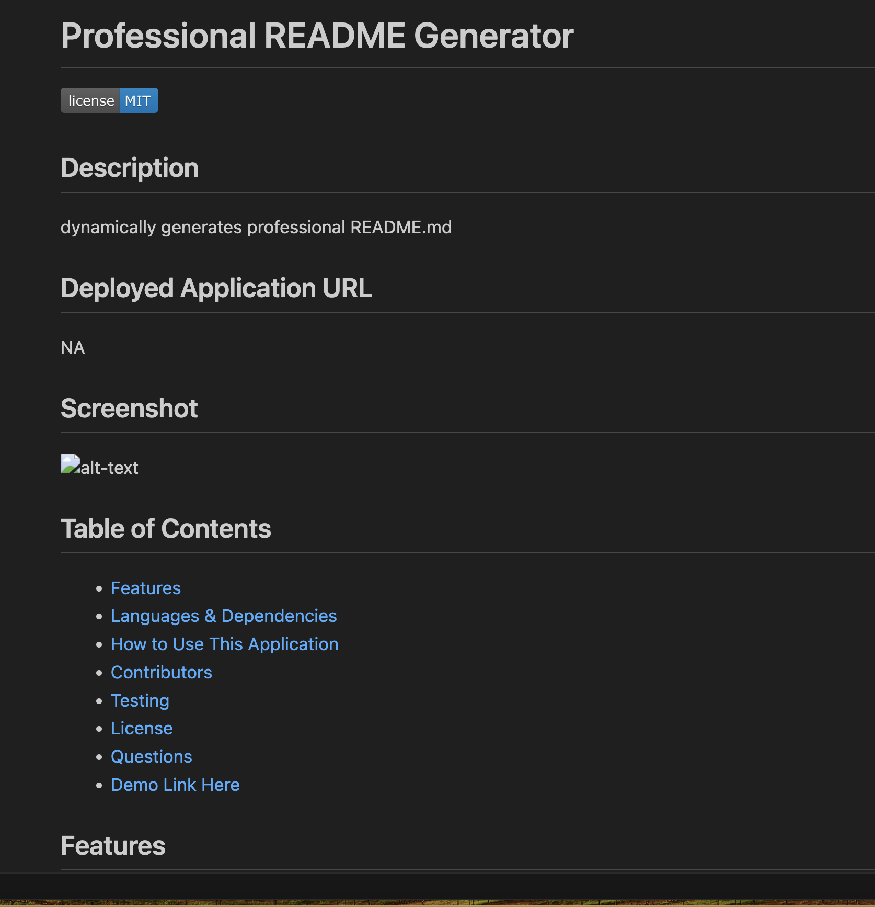

# Professional README generator
  
  
  ## Description
  Dynamically generates README.md file for 
  ## Deployed Application URL
  NA
  ## Screenshot
  
  ## Table of Contents
  * [Features](#features)
  * [Languages & Dependencies](#languages-and-dependencies)
  * [How to Use This Application](#how-to-use-this-application)
  * [Contributors](#contributors)
  * [Testing](#testing)
  * [License](#license)
  * [Questions](#questions)
  * [Demo Link Here](https://drive.google.com/file/d/1jbn0JAmfWjoOr5KAR426DF3QyKMhCrQb/view)
  
  ## Features
  ....
  ## Languages and Dependencies
  Inquirer
  ## How to Use This Application
  java script, node js
  ## Contributors
  invokes by typing in the terminal the following command: node index
  ## Testing
  invokes by typing in the terminal the following command: node index
  ## License
    This project is licensed under MIT
  ## Questions
  Please send your questions [here](mailto:kan.yulya@gmail.com?subject=[GitHub]%20Dev%20Connect) or visit [github/YuliyaTsoy](https://github.com/YuliyaTsoy).
